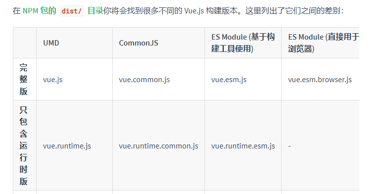

### Runtime Only VS Runtime + Compiler



以上在官网可以看到，也可以从npm install vue后的vue包里找到相对应的包，由此我们都知道Vue源码为了适应不同的应用场景，将Vue打包成了不同版本的JS文件，但是最大区别的两种版本就是： `完整版`和`只包含运行时版`，完整版（`Runtime` + `Compiler`）就是在Vue中除了运行时的代码外还包含了编译器相关的代码，而只包含运行时（Runtime Only）就是只有运行时的相关代码，不包含编译器相关代码。

接下来我们展开讲讲。

首先，我们说的编译器是什么样的，百度百科有这样的解释

> 简单讲，编译器就是将“一种语言（通常为高级语言）”翻译为“另一种语言（通常为低级语言）”的程序。一个现代编译器的主要工作流程：源代码 (source code) → 预处理器 (preprocessor) → 编译器(compiler) → 目标代码 (object code) → 链接器 (Linker) → 可执行程序 (executables)。

通俗点讲，编译器是一个提供了将源代码转化为目标代码的工具。从Vue的角度出发，内置的编译器实现了将template模板转换编译为可执行JavaScript脚本的功能。

#### Runtime + Compiler

一个完整的Vue版本是包含编译器的，我们可以使用个template进行模板编写，编译器会自动将模板字符串变异成渲染函数，也就是我们常说的render函数。所以如果你需要在客户端编译模板（比如传入一个字符串给template选项，或挂载到一个元素上并以其DOM内部的HTML作为模板），这个时候就需要包含编译器的版本。

```
// 需要编译器的版本
newVue({
template:'<div>{{ hi }}</div>'
})
```


#### Runtime Only

只包含运行时的代码拥有创建Vue实例，渲染并处理Virtual DOM等功能，基本上就是出去编译器外的完整代码。`Runtime Only`的适用场景有两种：

1. 我们在选项中通过手写`render`函数去定义渲染过程，这个时候并不需要包含编译器的版本便可完整执行。

   ```
   // 不需要编译器
   newVue({
       render (h){
       return h('div',this.hi)
       }
   })
   ```

2. 借助`vue-loader`这样的编译工具进行编译，当我们利用`webpack`进行vue的工程化开发时，常常会利用vue-loader对.vue进行编译，尽管我们也是利用template的模板标签去书写代码，但是此时的vue已经不需要利用编译器去负载模板的编译工作了，这个过程交给了插件去实现。

很明显，编译过程对性能会造成一定的损耗，并且由于加入了编译的流程代码，vue代码的总体积也更加庞大（运行时版本相比完整版本体积要小约30%）。因此在实际开发中，我们需要借助像webpack的vue-loader这类工具进行编译，将vue对模板的编译阶段合并到webpack的构建流程中，这样不仅减少了生产环境代码的体积，也大大提高了运行时的性能，一局两得。


